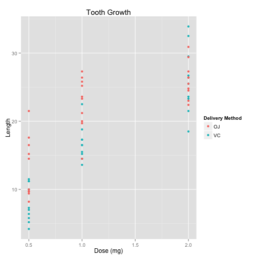
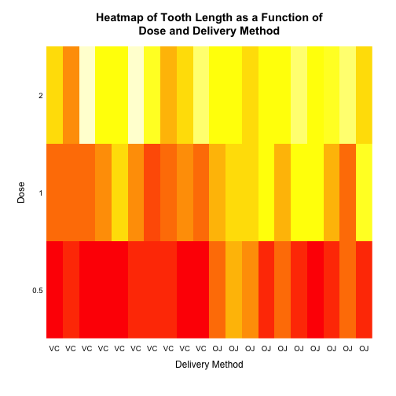
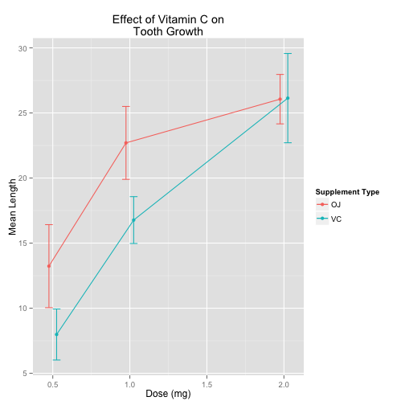
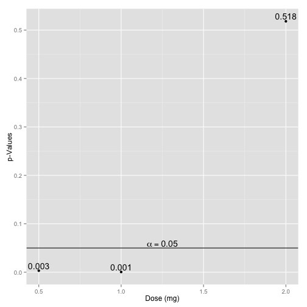

<style type="text/css">

table {
   max-width: 95%;
   border: 1px solid #ccc;
   margin-left:auto;
   margin-right:auto;
}
 
th {
  background-color: #dcdcdc;
}
 
td {
  background-color: #dcdcdc;
}
</style>

# Statistical Inference Course Project: Part 2


### Overview
This project consists of a simple data analysis of the "ToothGrowth" data included in the R "datasets" package. The "ToothGrowth" dataset is small, with only 60 observations and 3 variables. It describes the effect of three dosage levels of Vitamin C with each of two delivery methods in each of 10 guinea pigs. The variables are defined as follows:

* len - A numeric vector indicating the measurement of tooth length after Vitamin C delivery
* supp - A factor vector describing the delivery method used. Either Orange Juice (OJ) or Ascorbic Acid (VC)
* dose - A numeric vector indicating the dosage level in milligrams (0.5, 1, or 2mg)

Further information can be found in the R documentation for the dataset (?ToothGrowth)

This project consists of the following sections:

* Basic Summary
* Confidence Intervals
* Hypothesis Tests
* Conclusions

### Basic Summary
We begin by taking a look at the tooth growth data in the plot shown below.

```r
#Use dplyr to group tooth data by supp and dose
tg <- tbl_df(ToothGrowth) %>%
select(supp, dose, len) %>%
group_by(supp, dose) 

#Plot tooth data
qplot(dose, len, data=tg, col=supp, xlab="Dose (mg)", ylab="Length", main="Tooth Growth") + scale_color_discrete(name="Delivery Method")
```

 

As expected, the plot shows that tooth length increases with increased dosage of Vitamin C. However, it also seems to indicate that tooth length tends to be greater when the Vitamin C is delivered using Orange Juice rather than Ascorbic Acid. Although the difference in delivery method becomes less clear at the 2.0 mg dosage.

Another method of observing the trends in the data is using a heatmap as shown below. The rows indicate different dosages and the columns indicate the different delivery methods---the first 10 columns being the Ascorbic Acid observations and the last 10 columns being the Orange Juice observations.

Whiter colors indicate greater tooth length and redder colors indicate shorter tooth length.

```r
#Organize tooth data into matrix
tm <- tg %>%
ungroup %>%
arrange(dose)
tm <- matrix(tm$len, 3, 20, byrow=TRUE)

#Plot heatmap of matrix data
image(t(tm), axes=F)
mtext(text=rep(c("VC", "OJ"), each=10), side=1, line=0.3, at=seq(0, 1, length.out=20), las=1, cex=0.8)
mtext(text=c(0.5, 1, 2), side=2, line=0.3, at=seq(0, 1, length.out=3), las=1, cex=0.8)
axis(2, at=0.5, labels="Dose", line=0.75, tick=F)
axis(1, at=0.5, labels="Delivery Method", line=0.75, tick=F)
title(main="Heatmap of Tooth Length as a Function of\nDose and Delivery Method")
```

 

The same trends described above are apparent in the heatmap. Higher dosages lead to greater tooth length (whiter colors), and within each dosage level the Orange Juice delivery method usually performs better. However, within the 2.0 mg dosage level the difference between Ascorbic Acid and Orange Juice is less pronounced.

### Confidence Intervals
A more precise measurement of differences between the delivery methods is performed by calculating averages at each dosage level with associated confidence intervals.

```r
#Create data frame with means, standard deviation, and confidence intervals
mns <- summarize(tg, mean=mean(len), sd=sd(len))
mns <- mutate(mns, low_conf = mean - qt(0.975, 9) * sd/sqrt(10), upper_conf = mean + qt(0.975, 9) * sd/sqrt(10))

#Display table of means and confidence intervals
mns <- mns %>%
rename(Supplement=supp, Dose=dose, Mean=mean, Standard_Dev=sd, Lower_Conf=low_conf, Upper_Conf=upper_conf) %>%
mutate(Standard_Dev = round(Standard_Dev, 2), Lower_Conf = round(Lower_Conf, 2), Upper_Conf = round(Upper_Conf, 2))
knitr::kable(mns, format="markdown")
```


|Supplement | Dose|  Mean| Standard_Dev| Lower_Conf| Upper_Conf|
|:----------|----:|-----:|------------:|----------:|----------:|
|OJ         |  0.5| 13.23|         4.46|      10.04|      16.42|
|OJ         |  1.0| 22.70|         3.91|      19.90|      25.50|
|OJ         |  2.0| 26.06|         2.66|      24.16|      27.96|
|VC         |  0.5|  7.98|         2.75|       6.02|       9.94|
|VC         |  1.0| 16.77|         2.52|      14.97|      18.57|
|VC         |  2.0| 26.14|         4.80|      22.71|      29.57|
The confidence intervals calculated above correspond to a 95% confidence level, indicating that there is a 95% chance that the true average falls within the interval based on the calculated sample mean. A plot displaying the means and associated confidence levels is shown below.

```r
#Plot means and confidence intervals
pd <- position_dodge(0.1)

ggplot(mns, aes(x=Dose, y=Mean, ymax=max(Upper_Conf), color=Supplement)) + geom_errorbar(aes(ymin=Lower_Conf, ymax=Upper_Conf), width=0.1, position=pd) + geom_line(position=pd) + geom_point(position=pd) + xlab("Dose (mg)") + ylab("Mean Length") + ggtitle("Effect of Vitamin C on\nTooth Growth") + scale_color_discrete(name="Supplement Type") 
```

 

As the plot indicates, at dosage levels of 0.5 mg or 1 mg the average tooth length is quite confidently higher when delivered using Orange Juice rather than Ascorbic Acid. However, at 2.0 mg the delivery methods have almost identical averages with overlapping confidence intervals. Therefore it becomes less clear at the 2.0 mg dosage level whether there is a difference based on delivery method.

### Hypothesis Test
Another method of determining the differences across delivery methods is by performing a hypothesis test on the null hypothesis that Orange Juice and Ascorbic Acid supplements have the same effect at equivalent dosage levels. Under the null hypothesis the tooth growth data produces the following p values:

```r
#Format tooth data by spreading supplement types into VC and OJ values to allow for hypothesis testing
tg <- tg %>%
ungroup %>%
arrange(dose) %>%
mutate(index=c(rep(1:10,2), rep(11:20,2), rep(21:30,2))) %>%
select(index, supp, dose, len) %>%
spread(supp, len) %>%
group_by(dose)

#Hypothesis testing with null hypothesis being that there is no difference between tooth growth of VJ and OJ
hypo <- summarize(tg, p_val = t.test(OJ, VC, alternative="g")$p.value)
hypo <- rename(hypo, Dose=dose, p_Value=p_val)
knitr::kable(hypo, format="markdown")
```


| Dose|   p_Value|
|----:|---------:|
|  0.5| 0.0031793|
|  1.0| 0.0005192|
|  2.0| 0.5180742|

In order to further evalutate the results of the hypothesis tests at different dosages we plot the p-values against an $\alpha$ value of 0.05 below, meaning that if the p-value falls below 0.05 we reject the null hypothesis otherwise we fail to reject the null hypothesis.


```r
#Plot p-values of hypothesis test on each dose value
ggplot(hypo, aes(x=Dose, y=p_Value)) + geom_point() + geom_hline(aes(yintercept=0.05)) + xlab("Dose (mg)") + ylab("p-Values") + geom_text(aes(label=round(p_Value, 3)), hjust=0.5, vjust=-0.3) + annotate("text", x=1.25, y=0.06, label=paste("alpha ==", 0.05, sep=""), parse=T)
```

 

As the plot shows, the hypothesis tests at dosage levels of 0.5 mg and 1 mg reject the null hypothesis, but at 2.0 mg the hypothesis test fails to reject the null hypothesis.

### Conclusions

Both the confidence intervals and hypothesis tests indicate that at lower dosages, specifically 0.5 mg and 1 mg, the Orange Juice delivery method results in longer teeth than the Ascorbic Acid. However, at higher dosages, specifically 2 mg, there appears to be little difference and certainly not enough to reject the null hypothesis that they have the same effect.

However, the plot of means and confidence intervals does hint at a flattening out of effectiveness when using the Orange Juice method at a faster rate than when using the Ascorbic Acid method.  This might warrant further exploration to see if Ascorbic Acid results in greater tooth length than Orange Juice and higher dosages.
